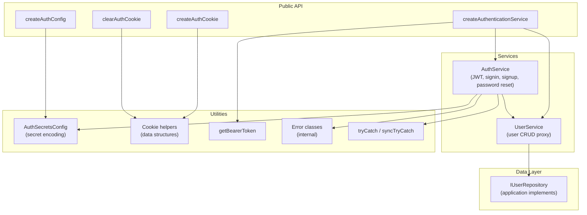
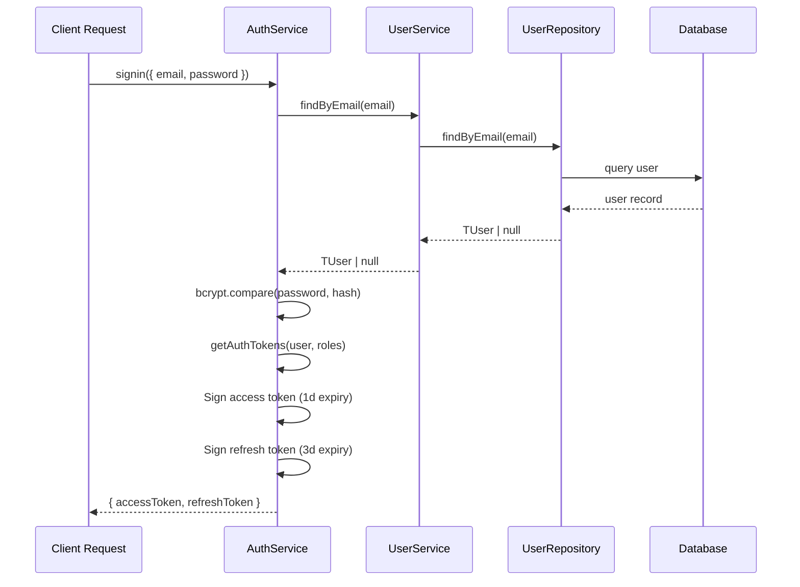
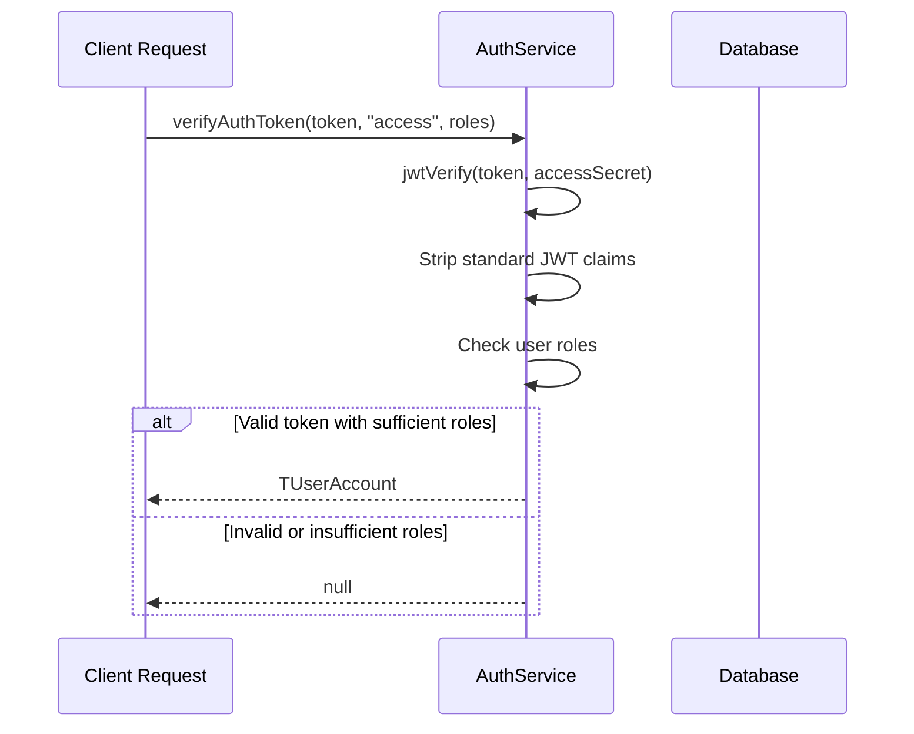
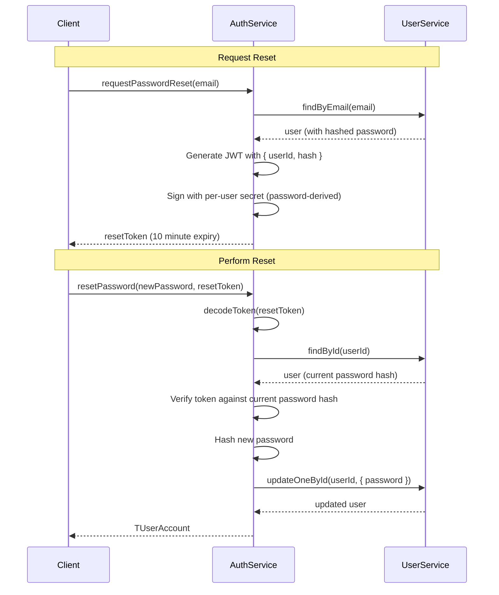

# Architecture

## Design Philosophy

`@tindanzor/auth-server` is built on three core principles:

1. **Dependency Inversion** — The library depends on `IUserRepository` (an interface), not a concrete database implementation. Your application provides the repository, and the library handles all auth logic on top of it.

2. **Configuration Over Modification** — You supply JWT secrets, cookie settings, and repository implementations. The library provides no defaults for these and does not expect you to override internal behavior.

3. **Framework Agnostic** — The library has zero HTTP framework dependencies. It provides data structures for cookies and tokens, but your application is responsible for applying them to HTTP responses. This means it works with Express, Fastify, Hono, Next.js server actions, or any other runtime.

## Module Diagram

## Data Flow

### Sign-In Flow

### Token Verification Flow

### Password Reset Flow

## Key Design Decisions

### Per-User Derived Secrets

Password reset and registration access tokens use secrets derived from the user's own data (specifically, the password hash concatenated with a base secret). This means:

- A password reset token is automatically invalidated when the user changes their password (the hash changes, so the derived secret changes)
- A registration access token is automatically invalidated once the skeleton account is filled in (the password changes)

This is a clever security mechanism that avoids the need for a token revocation list.

### UserService as a Pass-Through Facade

`UserService` delegates every method directly to `IUserRepository`. Its purpose is to provide an interface boundary — `AuthService` depends on `IUserService`, not `IUserRepository`. This allows the service layer to be swapped, decorated, or mocked independently of the repository.

### Cookie Helpers Return Data, Not Side Effects

`createAuthCookie` and `clearAuthCookie` return data structures (`SetCookieResult`, `ClearCookieResult`) rather than directly setting cookies on a response. This keeps the library framework-agnostic — your application calls `res.cookie()` or `setCookie()` with the returned data.

### Sign-In Lookup Strategies

`AuthService.signin` supports four lookup strategies based on the shape of the sign-in props:

1. **email + phone** — `findByEmailOrPhone({ email, phone })`
2. **email only** — `findByEmail(email)`
3. **phone only** — `findOne("phone", phone)`
4. **username** — `findOne("username", username)`

This flexibility allows the same auth service to support different login flows depending on your application's needs.

### Generic Extensibility

`AuthService` is generic over three type parameters:
- `TUserAccount` — the user model (must extend `IUserAccount`)
- `TSignupProps` — the registration payload
- `TSigninProps` — the login payload

This allows extending the user model with custom fields while maintaining type safety throughout the auth flow.

## Scope

This library contains **only** authentication infrastructure. If a module would still exist without authentication in the application, it does not belong here.
