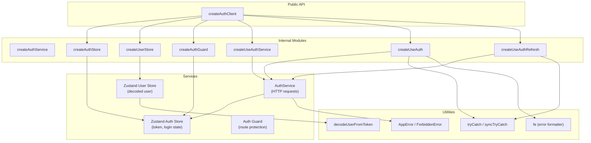
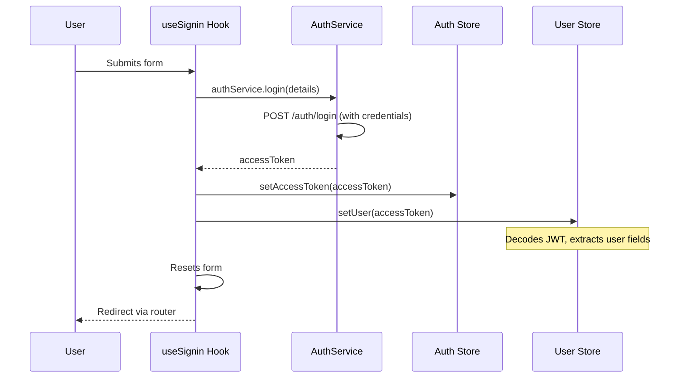
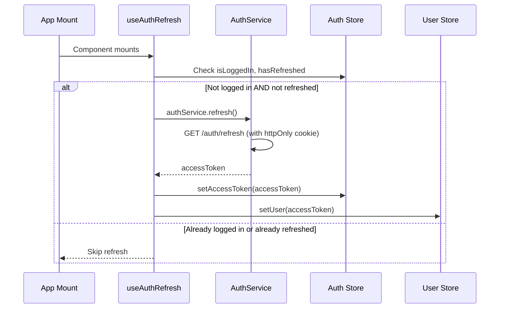
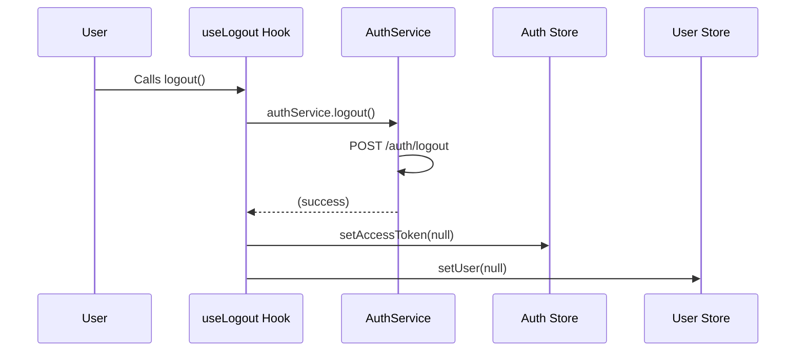

# Architecture

## Design Philosophy

`@tindanzor/auth-client` is built on three core principles:

1. **Factory Pattern** — Every component (stores, services, hooks, guards) is created via a factory function. This enables full generic type parameterization, so your user type, login payload, and register payload flow through the entire system with type safety.

2. **Configuration Over Modification** — The library does not provide defaults for secrets, endpoints, or redirect behavior. You supply configuration, and the library wires everything together. There is nothing to override or monkey-patch.

3. **Composability** — While `createAuthClient` provides an all-in-one entry point, every piece can also be used independently. Need just the auth store? Use `createAuthStore`. Need just route guards? Use `createAuthGuard`.

## Module Diagram



## Data Flow

### Login Flow



### Token Refresh Flow



### Logout Flow



## Key Design Decisions

### Dual Store Architecture

Auth state and user state are kept in separate Zustand stores:

- **Auth Store** — Holds `accessToken`, `isLoggedIn`, and `hasRefreshed`. This is the source of truth for authentication status. It does not know about user details.
- **User Store** — Holds the decoded user object (extracted from the JWT payload minus standard claims). It is populated from the access token.

This separation means:
- The auth store is framework-agnostic in concept (token in, boolean out)
- The user store focuses on the decoded JWT payload shape
- Both stores are independently testable

### Generic Type Parameters

The type parameters flow through the entire system:

```
createAuthClient<TUser, TLogin, TRegister, TResetPassword?, TRequestPasswordReset?>
  ├── useAuthStore: AuthStore (always the same shape)
  ├── useUserStore: UserStore<TUser> (your user type)
  ├── useAuthService: IAuthService<TLogin, TRegister, ...>
  ├── useSignin: returns form for TLogin
  ├── useSignup: returns form for TRegister
  └── useAuthRefresh: decodes JWT as TUser
```

This means if your login payload has `{ email: string; password: string }`, the `useSignin` hook will enforce that type on the form, and any errors will be type-checked at compile time.

### Silent Refresh Pattern

`useAuthRefresh` implements the standard "try refresh on mount" pattern:

1. On component mount, check: am I not logged in AND have I not yet attempted a refresh?
2. If both conditions are true, call `authService.refresh()`
3. On success, set the access token and decode the user
4. On failure, silently ignore (the user remains logged out)
5. Set `hasRefreshed = true` regardless of outcome to prevent retry loops

The `hasRefreshed` flag is critical — it lives in the auth store and prevents infinite refresh loops if the refresh endpoint fails.

### Cookie-Based Refresh

All HTTP requests from `AuthService` use `withCredentials: true`. This means:
- The **access token** lives in Zustand state (client-side, JavaScript-accessible)
- The **refresh token** lives in an httpOnly cookie (server-side, not accessible to JavaScript)

This is the standard secure pattern: short-lived access tokens in memory, long-lived refresh tokens in httpOnly cookies.

### Hook Factories

React hooks are created via factory functions (`createUseAuth`, `createUseAuthService`, `createUseAuthRefresh`) that close over store references. This avoids:
- React Context providers and the associated re-render issues
- Prop drilling
- Global singleton stores (each `createAuthClient` call creates its own store instances)

When using `createAuthClient`, these factories are called internally and the resulting hooks are returned ready to use.

## Scope

This library contains **only** authentication infrastructure. If a module would still exist without authentication in the application, it does not belong here.
